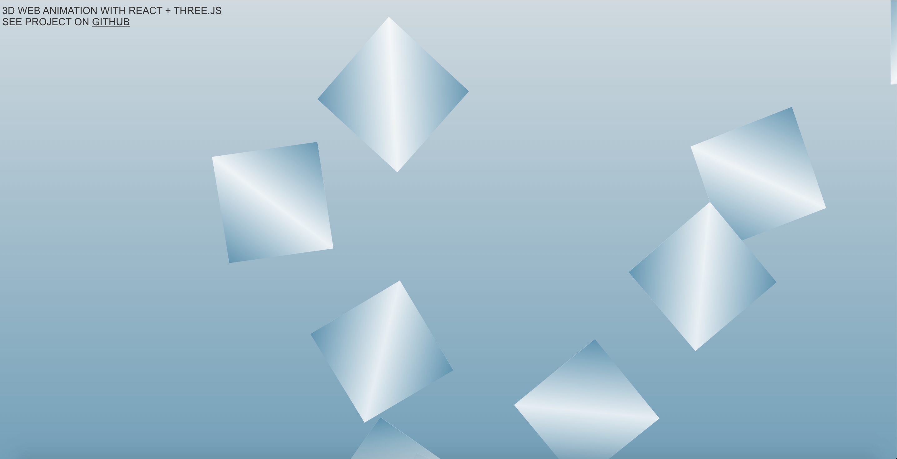

# 3D web animation made with React, Three.js, physics engine

3D web animation made with React, Three.js, and physics engine [Physijs](https://github.com/chandlerprall/Physijs).  The 3D pieces move according to the physics engine's gravity and are draggable.  

Made with create-react-app.

[visit live app](https://3d-animation.netlify.app)

## Tech

**Stack**: CSS, JavaScript, Three.js, [Physijs](https://github.com/chandlerprall/Physijs) 
**Framework**: React with CRA 
**Deployment**: Netlify

## Visual

