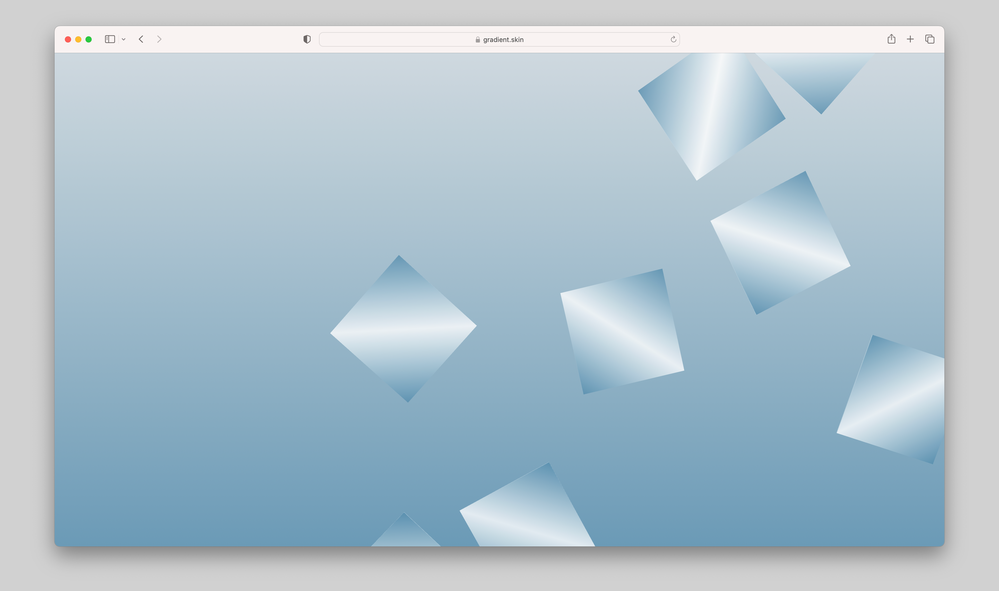

# 3D web animation made with physics engine

The 3D pieces move according to the physics engine's gravity and are draggable.  

[visit live app](https://gradient.skin/)

## Tech

**Stack**: JavaScript, Three.js, [Physijs](https://github.com/chandlerprall/Physijs) 
**Framework**: React with CRA 
**Deployment**: Netlify

## Visual

